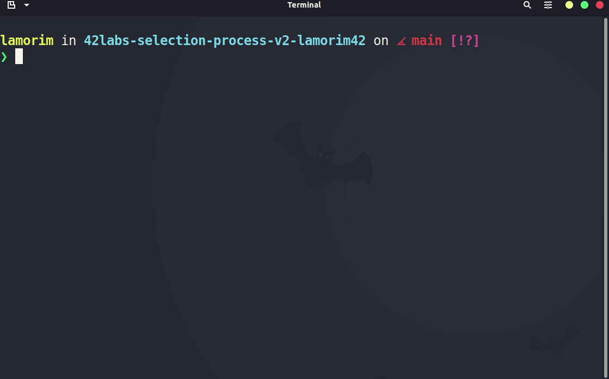
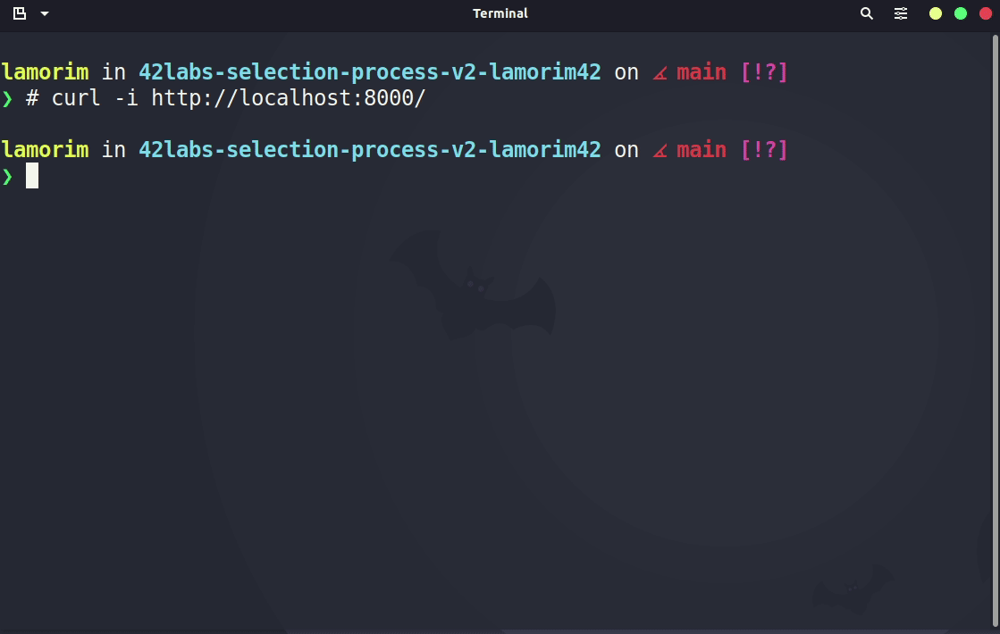
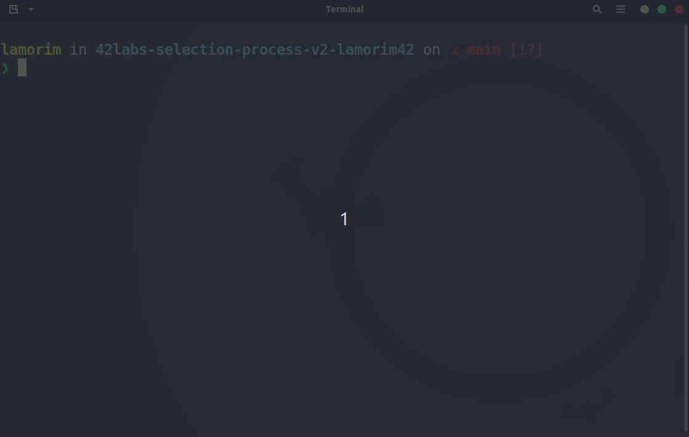
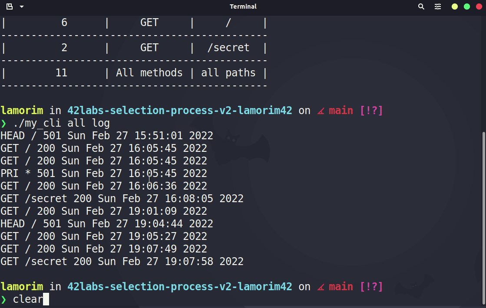

# 42Labs challenge

*Nesse desafio temos que construir duas aplicações utilizando C, uma API e uma CLI.*

- [Sobre o aprendizado](./info/concepts.md)

## Como navegar por esse repositório

[`API`](./API/) - arquivos fonte para gerar a API

[`CLI`](./CLI/) - arquivos fonte para gerar o CLI

[`info`](./info/) - informações extras sobre o desáfio e minha aprendizagem

---

## Tecnológias usadas no desenvolvimento do projeto

- **C**: o projeto foi feito usando a linguagem C;
- **MySQL**: como sistema gerenciador de banco de dados;
- **Makefile**: para altomatizar a compilação dos programas;
- **vscode e Vim**: editores de texto para o desenvolvimento do projeto;
- [**git**](https://git-scm.com/): para o versionamento dos arquivos do projeto;
- [**github**](https://github.com/): para hospedagem dos arquivos;
- [**Docker**](https://docs.docker.com/):
para subir a api e almentar a portabilidade do app;
- [**insomnia**](https://insomnia.rest/):
organizador de requests para simular um client
- [**Trello**](https://trello.com/b/BI0mVYPc/42labs):
para planejamento do projeto;
- [**Notion**](https://www.notion.so/luishads/42Labs-13f19351f4f24ded9957394618483430):
para manter links e aprendizagens importantes para o desenvolvimento do projeto.
- **Servidor dedicado para hospedagem do banco de dados**:

```
Fornecido por turbomanifesto.org

CentOS v7.9.2009
Versão do MySQL    5.7.37
Intel(R) Xeon(R) D-2141I CPU @ 2.20GHz
16 VCPU
30 GB de memória RAM DDR4
```

## Frameworks e bibliotecas utilizados

- [**mongoose**](https://mongoose.ws/):
biblioteca utilizada na criação do código da API;
- [**libmysql**](https://docs.oracle.com/cd/E17952_01/mysql-5.6-en/index.html):
biblioteca utilizada para acessar o banco de dados;
- **Markdown**: framework utilizado para escrever a documentação.

---

## Como compilar o projeto

1. Clone o repositório

```shell
git clone https://github.com/42sp/42labs-selection-process-v2-lamorim42.git
```

2. Basta dar `make` no diretório que acabara de clonar. Um container com a aplicação da API será levantado e a API já estará disponivel para requisições em `localhost:8000/`. A CLI também será compilada ao dar o `make`

```shell
make
```



3. Para compilar apenas a CLI

```shell
make CLI
```

Depois de compilado o binário estará na pasta raiz `./my_cli`

---

# Utilizando a API

A API irá responder as requests de um cliente e salvar o log do request no arquivo `server.log`, localmente. Além disso a requisição `GET` no endpoit `/secret` retorna uma informção _secreta_ do banco de dados que está hospedado em um servidor _turbo_.

- [Explicando código da API](./API/README.md)

O cliente pode fazer request do tipo `GET` em dois endpoints na API. No `/` e no `/secret`. Será retornado um body no formato `JSON`.



# Utilizando a CLI

A CLI irá usar os dados de log gerados pela API, salvos no arquivo `server.log`, e os printa no terminal.

- [Explicando código da CLI](./CLI/README.md)

## Comandos da CLI

### - Para ver todas as requisições escritas no log

```shell
./my_cli all log
```

- Para ver as requisições válidas

```shell
./my_cli all
```



### - Para ver as requisições do método GET

```shell
./my_cli GET
```

- Para ver as requisições do método GET em um endpoint válido

```shell
./my_cli GET /

./my_cli GET /secret
```


